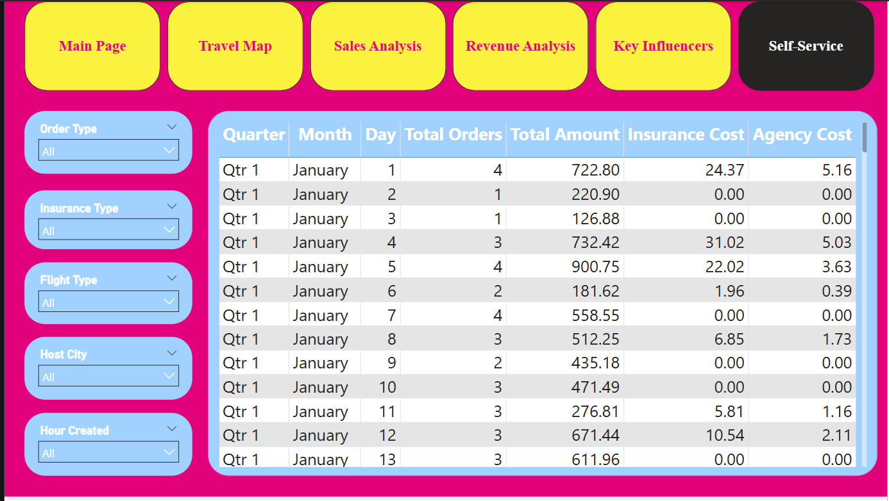
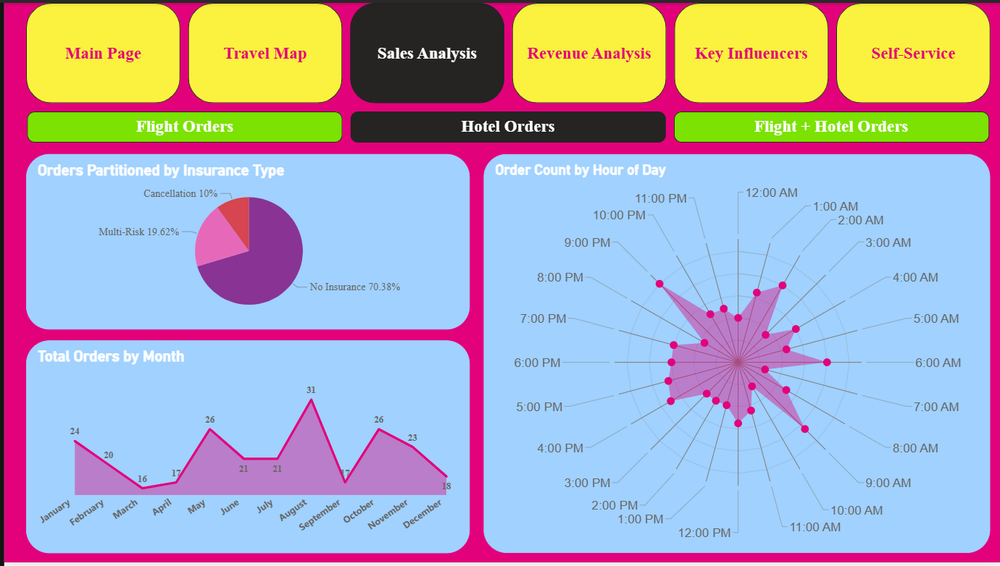

 🌍 Online Travel Agency (OTA) Dashboard
 Power BI Business Intelligence Project
 📌 Project Overview

This project presents an end-to-end **Business Intelligence dashboard** built using **Microsoft Power BI** for a simulated Online Travel Agency (OTA). The dashboard consolidates data from multiple travel service categories — flights, hotels, insurance, and orders — into a unified, interactive reporting solution that enables data-driven decision-making.

The goal of this project is to demonstrate the ability to transform raw transactional data into actionable business insights through thoughtful data modeling, DAX measures, and professional-grade visualizations.


🎯 Objectives

- Analyze order trends across flights, hotels, and insurance products
- Identify high-demand travel destinations and popular routes
- Understand insurance purchasing behavior and key influencing factors
- Track monthly revenue and order volume over time
- Provide a self-service reporting layer for flexible, ad-hoc analysis

📊 Dashboard Sections

| Section | Description |
|---|---|
| **Order Types** | Breakdown of total orders by category — flights, hotels, and insurance |
| **Travel Map Analysis** | Geographic visualization of travel destinations and flight patterns |
| **Insurance Analysis** | Distribution of insurance product types and purchase behavior |
| **Monthly Trends** | Time-series view of order volumes and revenue across months |
| **Insurance Cost Overview** | Cost comparison across different insurance plan types |
| **Key Influencers** | AI-powered visual identifying factors that drive insurance selection |
| **Self-Service Report** | Customizable report page with dynamic filters for user-defined analysis |

🗂️ Repository Structure

```
Online_Travel_Agency_Dashboard/
│
├── OTA Dashboard.pbix       # Main Power BI report file
├── OTA Dashboard.pdf        # Static PDF export of the dashboard
│
├── Flights.csv              # Raw data: flight bookings
├── Hotels.csv               # Raw data: hotel bookings
├── Insurances.csv           # Raw data: insurance products & claims
├── Orders.csv               # Raw data: master orders table
│
└── README.md                # Project documentation
```

🛠️ Tools & Technologies

| Tool | Purpose |
|---|---|
| **Microsoft Power BI Desktop** | Dashboard development & visualization |
| **Power Query (M Language)** | Data ingestion, cleaning & transformation |
| **DAX (Data Analysis Expressions)** | Custom measures, KPIs & calculated columns |
| **CSV Data Sources** | Structured flat-file data for flights, hotels, insurances, and orders |

📈 Key Features & Skills Demonstrated

- **Data Modeling** — Relationships built across multiple fact and dimension tables
- **DAX Measures** — Custom KPIs including revenue aggregations, order counts, and trend calculations
- **AI Visuals** — Power BI Key Influencers visual used for insurance behavior analysis
- **Geospatial Analysis** — Map visual for destination and route-level travel insights
- **Time Intelligence** — Monthly trend analysis using date hierarchies
- **User Empowerment** — Self-service page with slicers for flexible exploration

 🚀 Getting Started

 Prerequisites
- [Microsoft Power BI Desktop](https://powerbi.microsoft.com/desktop/) (free download)

Steps to Run
1. Clone or download this repository
2. Open `OTA Dashboard.pbix` in Power BI Desktop
3. Data is embedded — no additional configuration required
4. Use the navigation tabs to explore each dashboard section

> **Note:** To view a static preview without Power BI installed, open `OTA Dashboard.pdf`.

📷 Dashboard Preview

Open `OTA Dashboard.pdf` for a full static preview of all dashboard pages.

 💡 Business Value

This dashboard simulates the type of reporting solution a Business Analyst or Data Analyst would deliver to a travel company's management team. It supports decisions around:

- **Product strategy** — Which service categories drive the most revenue?
- **Marketing targeting** — Which destinations are most popular, and when?
- **Risk management** — What factors predict insurance uptake?
- **Operations planning** — How do bookings fluctuate month over month?

 Author

Tejendrasinh Sisodia
📁 [GitHub Portfolio](https://github.com/tejendrasinh51)

📄 License

This project is intended for educational and portfolio demonstration purposes. Data used is synthetic and does not represent real individuals or organizations.
"# TravelAgencyDashboard" 





